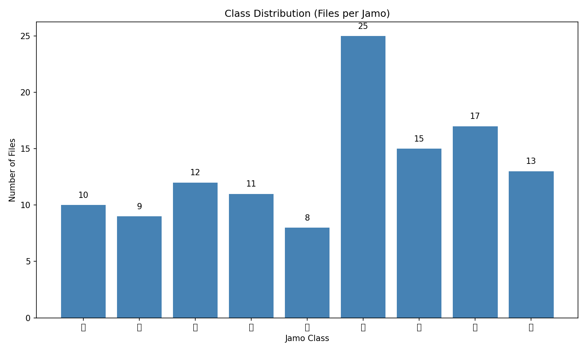
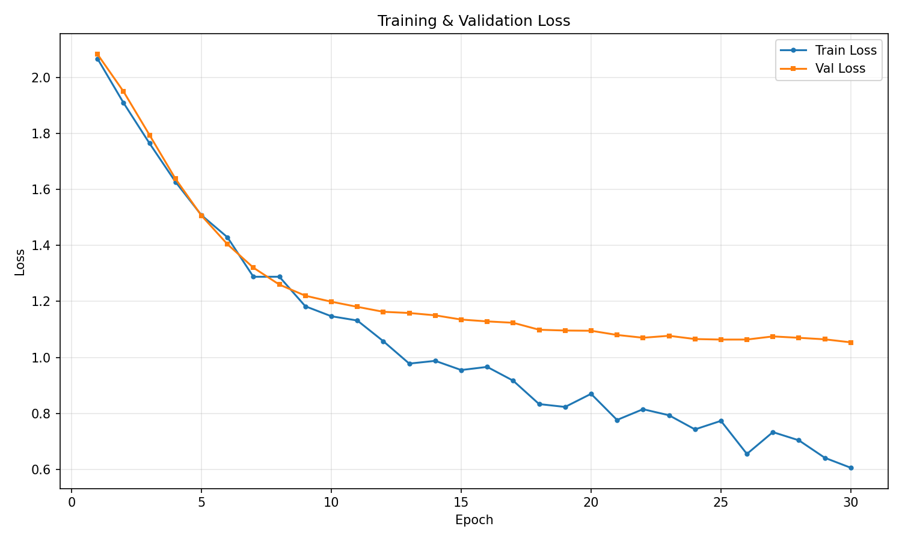
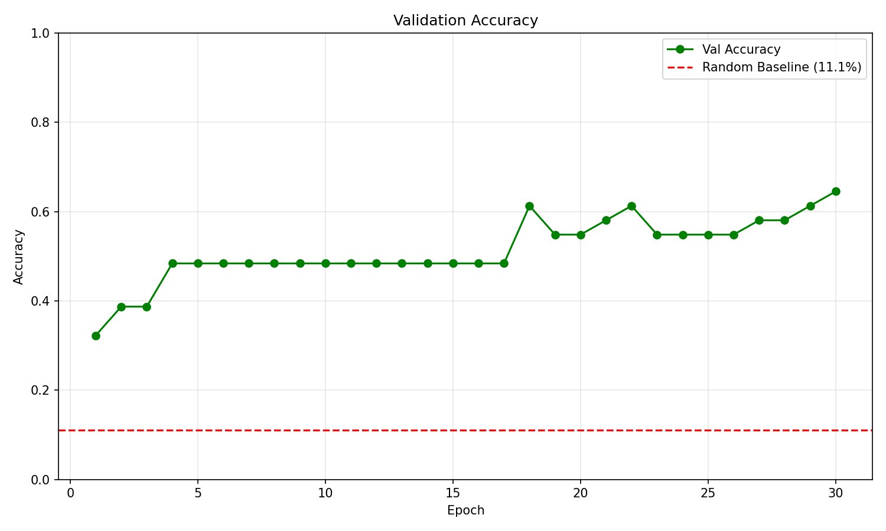
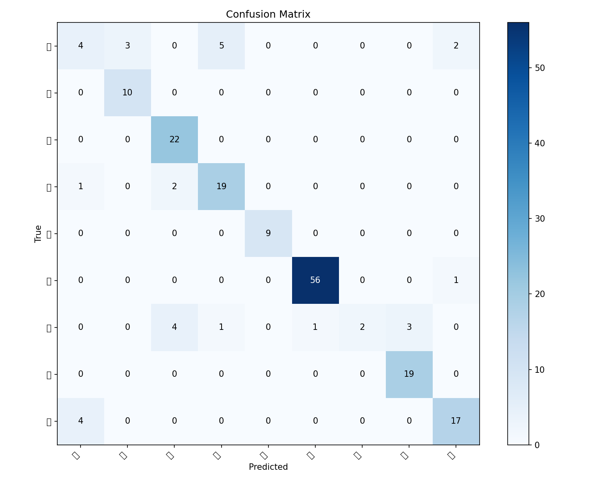

# Project River

EEG-based Korean Jamo classification using Muse 2 band power features and a lightweight CNN.

## Setup

```bash
python -m venv .venv
source .venv/bin/activate
pip install -r requirements.txt
```

## Data Structure

```
data/raw/
├── ㄱ/
│   └── mindMonitor_*.csv
├── ㄴ/
│   └── mindMonitor_*.csv
├── ㄷ/
│   └── ...
└── ...
```

Each CSV contains MindMonitor exports with band power columns:
- `Delta_TP9`, `Delta_AF7`, `Delta_AF8`, `Delta_TP10`
- `Theta_*`, `Alpha_*`, `Beta_*`, `Gamma_*`

## Usage

### Training

```bash
python examples/train_eegnet.py --epochs 50 --batch-size 32
```

Options:
- `--epochs`: Number of epochs (default: 50)
- `--batch-size`: Batch size (default: 64)
- `--lr`: Learning rate (default: 0.001)
- `--window`: Window size in seconds (default: 5.0)
- `--stride`: Stride in seconds (default: 2.0)

### Evaluation

```bash
python -m src.river.evaluate
```

### Inference

```bash
python examples/infer_eegnet.py --file data/raw/ㄱ/mindMonitor_xxx.csv
```

### Data Inspection

```bash
python examples/inspect_sample.py --jamo ㄱ --window 5.0
```

## Project Structure

```
src/river/
├── config.py       # Configuration
├── data_loader.py  # CSV loading and windowing
├── preprocessing.py # Normalization
├── datasets/       # PyTorch Dataset
├── models/         # EEGNet
├── train.py        # Training script
├── evaluate.py     # Evaluation script
└── analysis.py     # Analysis & visualization
```

## Classes

9 Korean Jamo characters: ㄱ, ㄴ, ㄷ, ㄹ, ㅇ, ㅏ, ㅓ, ㅡ, ㅣ

---

## Results

### Experiment Environment

| Item | Value |
|------|-------|
| Device | Mac mini M2 (MPS) |
| Python | 3.10 |
| PyTorch | 2.0+ |
| EEG Device | Muse 2 (4-channel) |
| Data Source | MindMonitor CSV |

### Data Specification

| Metric | Value |
|--------|-------|
| Total CSV files | 120 |
| Total samples (windowed) | 185 |
| Features | 20 (5 bands × 4 channels) |
| Window size | 5.0 seconds |
| Stride | 2.0 seconds |
| Sampling rate | ~1 Hz (band power) |

**Class Distribution:**

| Class | Files | Samples |
|-------|-------|---------|
| ㄱ | 10 | 14 |
| ㄴ | 9 | 10 |
| ㄷ | 12 | 22 |
| ㄹ | 11 | 22 |
| ㅇ | 8 | 9 |
| ㅏ | 25 | 57 |
| ㅓ | 15 | 11 |
| ㅡ | 17 | 19 |
| ㅣ | 13 | 21 |



### Model Summary

| Component | Specification |
|-----------|---------------|
| Architecture | EEGNet (simplified) |
| Input shape | (batch, 1, 5, 20) |
| Parameters | 18,889 |
| Hidden dim | 64 |
| Dropout | 0.5 |
| Optimizer | Adam (lr=0.001) |
| Loss | CrossEntropyLoss |

### Training Results

- **Best Validation Accuracy**: 64.52% (epoch 30)
- **Final Test Accuracy**: 85.41%





### Per-Class Performance

| Class | Accuracy | Samples |
|-------|----------|---------|
| ㄱ | 28.57% | 14 |
| ㄴ | **100.00%** | 10 |
| ㄷ | **100.00%** | 22 |
| ㄹ | 86.36% | 22 |
| ㅇ | **100.00%** | 9 |
| ㅏ | 98.25% | 57 |
| ㅓ | 18.18% | 11 |
| ㅡ | **100.00%** | 19 |
| ㅣ | 80.95% | 21 |

- **Best performing**: ㄴ, ㄷ, ㅇ, ㅡ (100%)
- **Worst performing**: ㅓ (18.18%), ㄱ (28.57%)



### Key Insights

1. **Overall Performance**: 85.41% accuracy significantly exceeds the random baseline (11.1%)
2. **Class Imbalance**: ㅏ has 57 samples while ㅇ has only 9 — 6x difference
3. **Confusion Patterns**:
   - ㄱ is often confused with ㄹ (5 cases) and ㄴ (3 cases)
   - ㅓ is confused with ㄷ (4 cases) and ㅡ (3 cases)
4. **Perfect Classes**: ㄴ, ㄷ, ㅇ, ㅡ achieve 100% accuracy

---

## Limitations & Future Work

### Current Limitations

1. **Data Scarcity**
   - Only 120 CSV files total, 185 windowed samples
   - Some classes have <15 samples (ㄱ, ㄴ, ㅇ, ㅓ)
   - Insufficient for robust generalization

2. **Class Imbalance**
   - ㅏ has 6x more samples than ㅇ
   - Model may be biased toward majority classes

3. **Low Sampling Rate**
   - MindMonitor outputs band power at ~1 Hz
   - Limits temporal resolution for windowing

4. **Single Subject**
   - Data likely from single participant
   - No cross-subject validation

### Recommended Improvements

1. **Data Collection**
   - Collect 50+ sessions per class (minimum)
   - Include multiple subjects for generalization
   - Consider raw EEG (256 Hz) for richer features

2. **Data Augmentation**
   - Time shifting
   - Noise injection
   - Mixup / CutMix for EEG

3. **Model Enhancements**
   - Class-weighted loss for imbalance
   - Learning rate scheduler
   - Early stopping with patience

4. **Architecture Exploration**
   - Original EEGNet (for raw EEG)
   - Attention mechanisms
   - Transformer-based models

5. **Evaluation**
   - K-fold cross-validation
   - Leave-one-subject-out validation
   - Statistical significance testing

---

# Project River (한글)

Muse 2 EEG 밴드 파워 특징과 경량 CNN을 사용한 한국어 자모 분류 프로젝트.

## 설치

```bash
python -m venv .venv
source .venv/bin/activate
pip install -r requirements.txt
```

## 데이터 구조

```
data/raw/
├── ㄱ/
│   └── mindMonitor_*.csv
├── ㄴ/
│   └── mindMonitor_*.csv
└── ...
```

## 사용법

### 학습

```bash
python examples/train_eegnet.py --epochs 50 --batch-size 32
```

### 평가

```bash
python -m src.river.evaluate
```

### 추론

```bash
python examples/infer_eegnet.py --file data/raw/ㄱ/mindMonitor_xxx.csv
```

## 결과 요약

- **전체 정확도**: 85.41%
- **최고 성능 클래스**: ㄴ, ㄷ, ㅇ, ㅡ (100%)
- **최저 성능 클래스**: ㅓ (18.18%), ㄱ (28.57%)
- **모델 파라미터**: 18,889개

## 한계점

1. 데이터 부족 (총 185개 샘플)
2. 클래스 불균형 (ㅏ: 57개 vs ㅇ: 9개)
3. 단일 피험자 데이터

## 향후 과제

1. 클래스당 50개 이상 데이터 수집
2. 다중 피험자 데이터 확보
3. 데이터 증강 기법 적용
4. 클래스 가중치 손실 함수 적용
